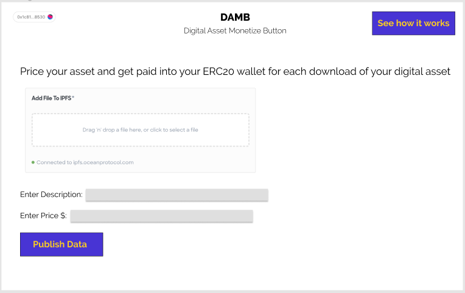
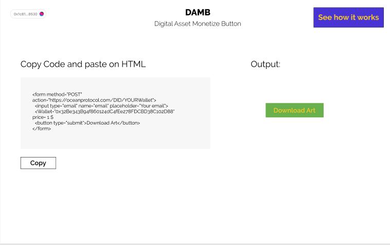

# DAMB Marketplace
Ocean Digital Assets Marketplace for selling files&Data, giving ability to preview them and compute data.

# How this works? 
1. Your URL is encripted and is given a DID using Ocean Protocol 
2. You set a price on your asset in $, under the hood it is priced in Ocean tokens based on current exchange rates 
3. You publish this asset on the blockchain by signing using metamask. The account used to sign is the token receiving wallet. 
4. Receive tokens for each download based on the traffic generated for the button. 

# Real-world use-cases:
1-I want to publish an asset and just give the people who pay the ability to view it.  
2-I want to give the people who pay the ability to compute the data.  
3-I want to confirm my ownership, proof of existence, protect rights when I do something I want to sale it and when sale it sale it's rights.

# Idea source from Dev Pramoth
